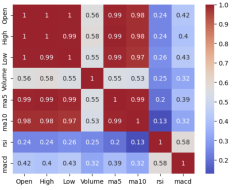
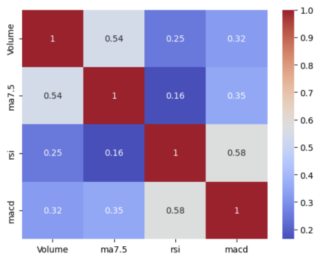
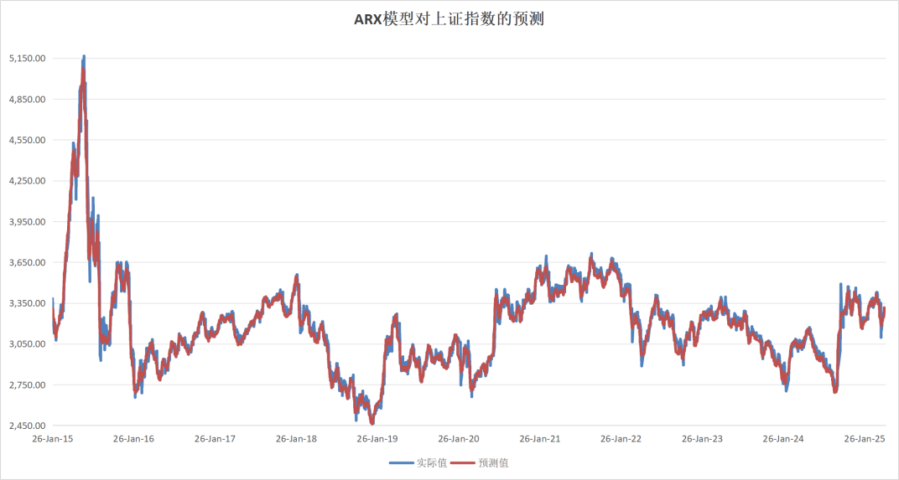

# Comparative Regression Analysis for Shanghai Composite Index Forecasting

> An academic forecasting project comparing linear, regularized, nonlinear and time-series regression methods using Shanghai Composite Index data and technical indicators.

## Project overview

This project studies how different regression families model the Shanghai Composite Index. Daily market data were combined with moving-average, RSI, MACD and volume features, standardized and examined for multicollinearity. The analysis then compared interpretable linear baselines, regularized models, nonlinear polynomial and spline models, and autoregressive specifications.

The original results suggest that linear models provided strong short-horizon fits, cubic polynomial regression captured additional nonlinearity, and the ARX specification achieved the lowest reported MSE and highest reported R² when exogenous technical indicators were included.

## Analysis workflow


## Feature review

Correlation analysis was used to identify overlapping signals and guide feature reduction before model fitting.

| Initial feature set | Reduced feature set |
|---|---|
|  |  |

## Results

| Model | MSE | R² |
|---|---:|---:|
| Linear Regression | 3,907.95 | 0.9632 |
| Lasso Regression | 3,906.79 | 0.9632 |
| Ridge Regression | 3,908.12 | 0.9632 |
| Polynomial Regression (degree 3) | 3,147.91 | 0.9703 |
| Autoregressive Model | 109,211.16 | 0.0401 |
| **ARX Model** | **2,541.43** | **0.9777** |

The complete comparison is available in [`outputs/model_metrics.csv`](outputs/model_metrics.csv). In the original study, ARX produced the strongest reported fit among the evaluated specifications.



## Paper and presentation

The repository includes the complete paper and the project presentation. Student identification numbers have been removed from the public versions; the analytical content is unchanged.

| File | Description |
|---|---|
| [`full_paper.pdf`](documents/full_paper.pdf) | Full paper in PDF format |
| [`presentation.pptx`](documents/presentation.pptx) | Project presentation slides |

## Repository structure

```text
.
├── assets/                 # README figures
├── data/
│   ├── raw/                # Yahoo Finance market data
│   └── processed/          # Technical indicators and model outputs
├── documents/
│   ├── full_paper.pdf      # Complete paper
│   └── presentation.pptx   # Presentation slides
├── notebooks/
│   └── original_analysis.ipynb
├── outputs/
│   └── model_metrics.csv
├── METHODOLOGY.md
├── README.md
└── requirements.txt
```

## Run locally

```bash
python -m venv .venv
source .venv/bin/activate        # Windows: .venv\Scripts\activate
pip install -r requirements.txt
jupyter notebook notebooks/original_analysis.ipynb
```

The notebook retains the original project logic. For an accurate reading of the final comparison and its limitations, see [`METHODOLOGY.md`](METHODOLOGY.md).

## Academic context

This repository presents the work described in my CV as **“Comparative Regression Analysis for Shanghai Composite Index Forecasting”**, completed as a researcher at Shanghai Jiao Tong University under the supervision of Prof. TANG Zhuodong (May–June 2025).

## Disclaimer

This repository is provided for academic and portfolio purposes only. Reported statistics are results from the original study and should not be interpreted as live-trading performance or investment advice.
